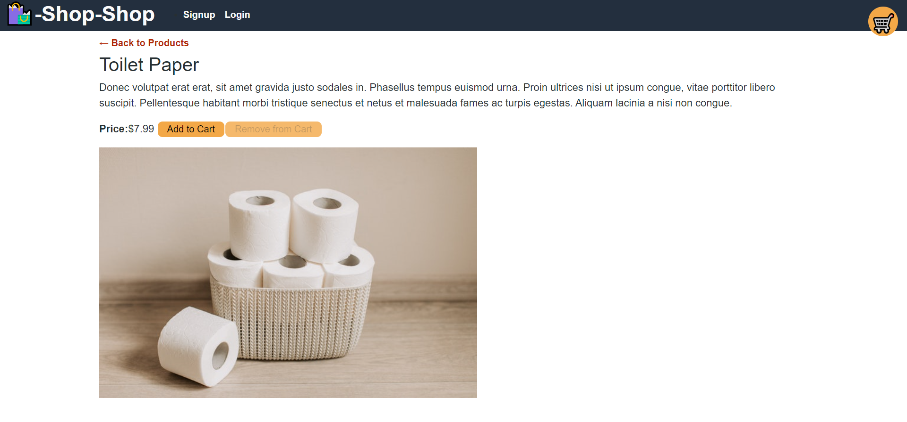

# Shop Shop Redux

## Description
A full-stack, end-to-end MERN ecommerce application using Redux, GraphQL and Apollo.  Features Stripe payment integration. Installable as a Progressive Web Application. 

##### Homescreen

##### Single Product View

##### Cart View

##### Stripe Payment View

Visit [Shop Shop Redux](https://nameless-wave-32421.herokuapp.com/)

## Table of Contents
  * [Installation](#installation)
  * [Usage](#usage)
  * [License](#license)
  * [Technologies](#technologies)
  * [Contributing](#contributing)
  * [Testing](#testing)
  * [Questions](#questions)
  
## Installation
Clone project to a directory on your local machine and cd into the shop-shop-redux directory.  Run <$ npm install> to install dependencies.  Run <$ npm start> to launch application on localhost port 3000.  Test API routes with GraphQL Playground at localhost:3001/graphql.

## Usage
Add and remove products from your cart as desired.  When ready to check out, user must sign up for an account. Test checkout functionality is handled by Stripe payment processing where user can enter payment details.  Once payment is successfully processed, user will be redirected back to shopping page where they can choose to view their order history.

## License 
This project is covered under the MIT license 

## Technologies 
MERN Stack, Redux, GraphQL, Apollo, JSON Web Token, Stripe API

## Contributing
To see the guidelines adopted for contributing to this project, please view the [Contributor Covenant](https://www.contributor-covenant.org/version/2/0/code_of_conduct/code_of_conduct.txt)

## Testing
Navigate to client directory and execute the command <$ npm run test> to show passing test suite

## Questions
Visit me at GitHub  
[christopherConcannon](https://github.com/christopherConcannon)
  
If you have any questions or would like to contact me, please email me at  
[cmcon@yahoo.com](mailto:cmcon@yahoo.com)
